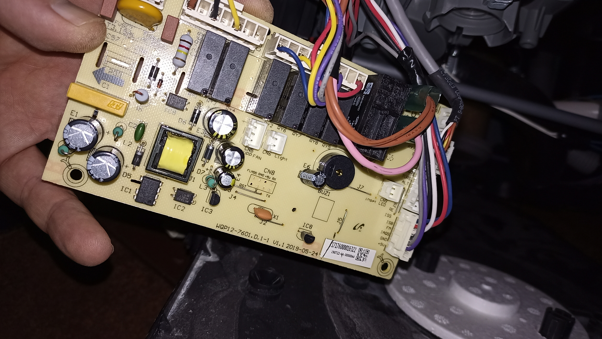
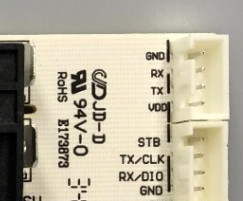

# MiDishESP
Управление посудомоечной машиной Midea с помощью ESP8266/ESP32 плат и ESPHome

Имеется: посудомоечная машина (ПММ) Midea MID60S300. Основана на плате управления WQP12-7601.D.1-1 V1.1

Машинка не имеет модуля Wi-Fi, но имеет разведенный на плате управления UART (разъем CN1).

Задача: интегрировать ПММ в систему "умный дом" на базе Home Assistant и ESPHome для управления и мониторинга работы.

В режиме ожидания (да и во время выполнения программы) ПММ передает в UART такой пакет (числа в шестнадцатеричном формате):
55 0D 89 02 00 00 00 00 00 00 00 00 00 00 00 8B
Где: 
1. 55h - признак начала пакета (01010101 в бинарном виде)
2. 0Dh - длина пакета (13 байт)
3. 89h - код оборудования???
4. 02h - ???

...

16. 8Bh - CRC-8/MAXIM (Dallas)???

CRC считается по непонятному алгоритму. Опытным путем выяснил, что плата не проверяет CRC входящих пакетов.
